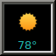

wmforecast 
==========
 

wmforecast is a weather dockapp for
[Window Maker](http://windowmaker.org)
using the
[Yahoo Weather API](https://developer.yahoo.com/weather/)

The icons were designed by MerlinTheRed and are available at
<http://merlinthered.deviantart.com/art/plain-weather-icons-157162192>

Download
--------

To download, either clone the git repository:

    git clone https://github.com/d-torrance/wmforecast

or download a tarball from the
[releases page](https://github.com/d-torrance/wmforecast/releases).

wmforecast binary packages are also available in the Debian and Ubuntu archives,
but possibly older versions.  To obtain the latest version in Ubuntu, you may
use the PPA:

    sudo add-apt-repository ppa:profzoom/wmaker
    sudo apt-get update
	sudo apt-get install wmforecast

Installation
------------

To compile wmforecast from source, you will need

* [libcurl](https://curl.haxx.se/libcurl/)
* [libxml2](http://www.xmlsoft.org/)
* [WINGs](http://windowmaker.org/)

If building from git (not necessary if using a tarball):

    ./autogen.sh

Then the usual

    ./configure
    make
    sudo make install

Usage
-----

    wmforecast [OPTIONS]
    Options:
    -v, --version            print the version number
    -h, --help               print this help screen
    -i, --interval <min>     number of minutes between refreshes (default 60)
    -u, --units <c|f>        whether to use Celsius or Fahrenheit (default f)
    -w, --woeid <woeid>      Where on Earth ID (default is 2502265 for
                             Sunnyvale, CA -- to find your WOEID, search
                             for your city at <http://weather.yahoo.com> and
                             look in the URL.)
    -z, --zip <zip>          ZIP code or Location ID (Yahoo has deprecated this
                             option and it is not guaranteed to work)
    -b, --background <color> set background color
    -t, --text <color>       set text color

Bugs
----

Please report bugs and feature requests at the
[issues page](https://github.com/d-torrance/wmforecast/issues).

Copyright
---------

### wmforecast
2014-2016 Doug Torrance
<dtorrance@piedmont.edu>
GNU General Public License v3+

### icons
2010 MerlinTheRed
<http://merlinthered.deviantart.com/>
Creative Commons Attribution-ShareAlike 3.0 License
